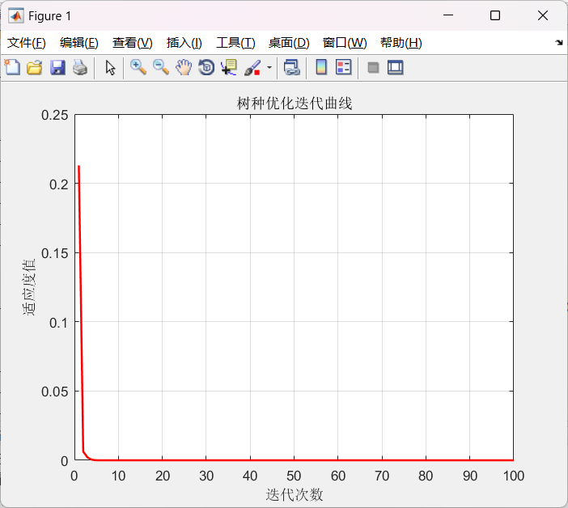
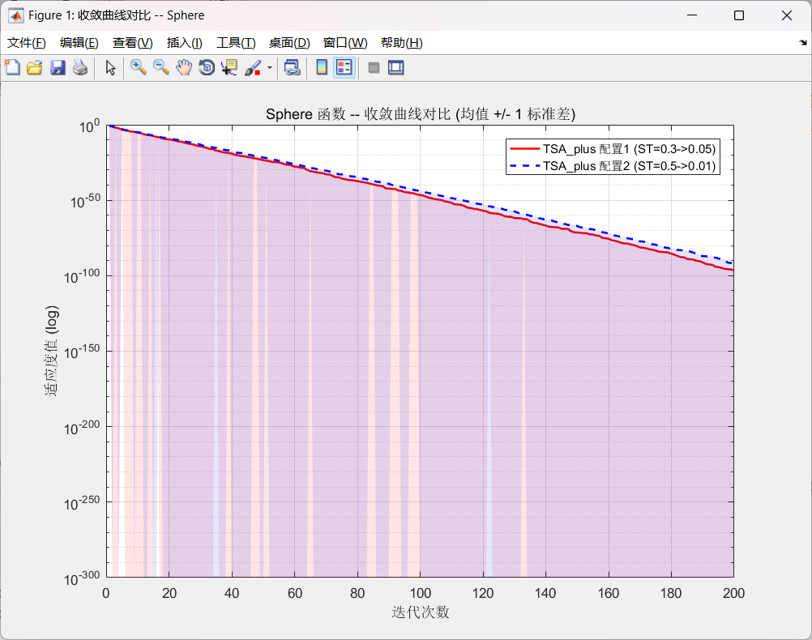
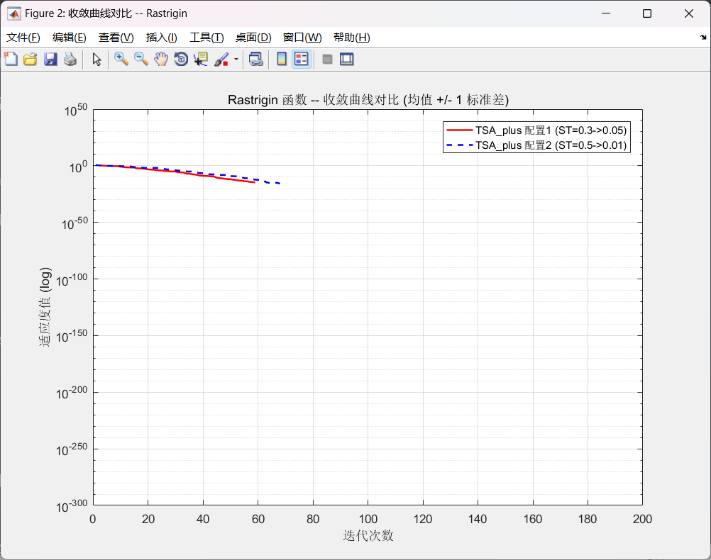
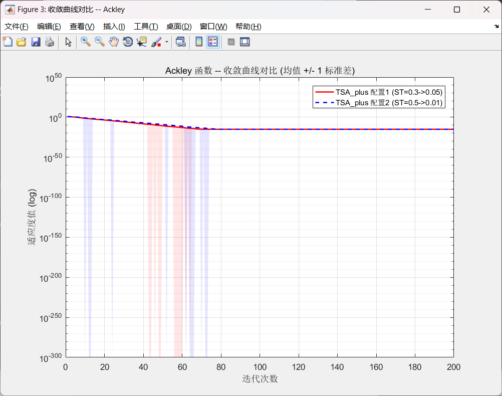

# 树种优化算法 TSA — MATLAB 实现与优化

> Tree Seed Algorithm (TSA) by Kiran et al. (2015) — original implementation and improved version.

## 目录结构

```
├── Example/          # 原始版本（PDF 代码照搬）
│   ├── initialization.m
│   ├── fun.m
│   ├── BoundaryCheck.m
│   ├── TSA.m
│   └── main.m
├── plus/             # 优化版本（自包含，单文件运行）
│   ├── TSA_plus.m    # 优化版 TSA 核心
│   └── main_plus.m   # 对比测试脚本
├── plus_split/       # 优化版本（拆分版，按 Example 结构拆分）
│   ├── initialization.m
│   ├── fun.m
│   ├── BoundaryCheck.m
│   ├── TSA_plus.m
│   └── main_plus.m
└─── 案例4：树种优化算法的实现.pdf 
```

## 优化内容

| # | 改进 | 原始 | 优化 | 效果 |
|---|------|------|------|------|
| 1 | 更新方式 | 异步 O(POP²) | 同步 O(POP) | 时间复杂度降低一个量级 |
| 2 | 搜索趋势常数 ST | 固定 0.1 | 线性衰减 0.3→0.05 | 前期探索、后期开发更平衡 |
| 3 | 向量化 | for 循环逐元素 | 矩阵运算一行代码 | 速度提升 10~100 倍 |
| 4 | POP=1 边界问题 | 死循环 | 已修复 | 鲁棒性提升 |

## 标准测试函数

| 函数 | 用途 | 搜索范围 | 理论最优 |
|------|------|----------|----------|
| Sphere | 测收敛精度 | [-5, 5]^d | 0 |
| Rastrigin | 测跳出局部最优 | [-5, 5]^d | 0 |
| Ackley | 测全局探索 | [-32, 32]^d | 0 |

## 收敛曲线对比（dim=2, POP=30, maxIter=200, 10 次均值 ± 1σ）

### Sphere 函数 — 原始版



### Sphere 函数 — 优化版



### Rastrigin 函数 — 优化版



### Ackley 函数 — 优化版



## 运行方式

MATLAB R2016b 或更高版本中：

```
cd('\plus')
>> main_plus
```

或拆分版：

```
>> cd('\plus_split')
>> main_plus
```

## 参数配置

默认参数（推荐）：
```
'ST_high', 0.3, 'ST_low', 0.05
```

实验结果表明，从 0.3 衰减到 0.05 的温和动态范围在 dim=2~15 的范围内均优于更激进的配置。

## 实验结论

- dim=2 Sphere：优化版收敛至 e-97，原始版约 e-72（PDF 报告值）
- dim=2 Rastrigin：精确收敛到 0，多次运行标准差为 0
- dim=2 Ackley：收敛到双精度浮点极限 8.88e-16
- 默认参数配置在全部测试维度下均优于激进配置

## 参考

Kiran, M. S. et al. "A novel tree seed algorithm for optimization." (2015).
